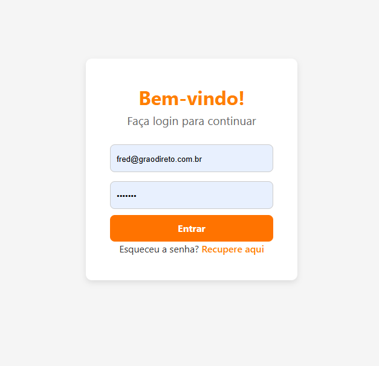

# 🍽️ MVP - Plataforma de Gastronomia
Este projeto é um MVP de uma plataforma de gastronomia, desenvolvido utilizando React no frontend e Node.js no backend. O sistema permite que os usuários façam login, visualizem uma lista de restaurantes e consultem detalhes do restaurante e seu cardápio.


## 📌 Stack utilizada

**Front-end:** React + Vite, Tailwind CSS (para estilização), React Router (para navegação), JWT (para autenticação), Axios (para comunicação com a API)

**Back-end:** Node.js + Express, MongoDB + Mongoose (para armazenamento de dados), bcrypt (para criptografia de senha), JSON Web Token (JWT para autenticação), CORS (para permitir requisições do frontend), Dotenv (para gerenciar variáveis de ambiente)

## 🚀 Rodando localmente

Clone o projeto

```bash
  git clone https://github.com/littlehopw/Projeto-Grao-Direto.git
```

### Configurar o Backend

Entrar na pasta do backend e instalar as dependências

```bash
 cd backend
 npm install
```

Criar o arquivo .env no diretório backend e adicionar as configurações

```bash
 MONGO\_URI=mongodb://127.0.0.1:27017/gastronomia

 JWT\_SECRET=sua\_chave\_secreta

 PORT=5000
```

Iniciar o Banco de Dados (MongoDB)

_(Caso o MongoDB não esteja rodando, inicie-o manualmente)_

```bash
  mongod
```
_(Se necessário, especifique o caminho do banco de dado)_

```bash
  mongod --dbpath C:\data\db
```

Popular o Banco de Dados com Dados Iniciais

```bash
 node seed.js
```

Rodar o Servidor Backend

```bash
 npm run dev
```

O backend estará rodando em http://localhost:5000

### Configurar o Frontend

 Voltar para a pasta raiz e entrar no frontend, instalando as dependências

```bash
 cd ../frontend
 npm install
```

Rodar o Front-end

```bash
 npm run dev
```

O frontend estará rodando em http://localhost:5173
## 🖼️ Demonstração

Tela de Login:



## 📜 Teste

Acesse http://localhost:5173

Faça login com as credenciais:

```bash
 Email: fred@graodireto.com.br
 Senha: 123Fred
```

Após o login, será exibida a lista de restaurantes:

- Utilize a barra de pesquisa para filtrar os restaurantes pelo nome ou pratos.
- Clique em um restaurante para visualizar os detalhes e o cardápio.